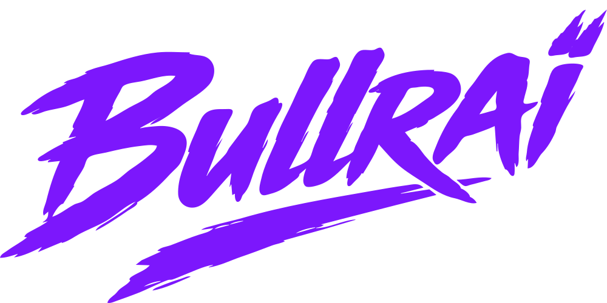

# Code Review — Bullraï Fightstick Configurateur

**Date :** 2026-04-04  
**Fichiers revus :** `index.html` (131 lignes), `app.js` (661 lignes), `style.css` (242 lignes)  
**Dernière mise à jour :** 2026-04-05

---

## 🔴 Bugs / Problèmes fonctionnels

### 1. HTML — Balise `</span>` orpheline (`index.html:15`) ✅ CORRIGÉ

```html
<span>FIGHTSTICK CONFIGURATEUR</span>
```

**Statut :** Déjà corrigé avant le début de la review.

---

### 2. HTML — MIME type incorrect pour le favicon (`index.html:6`) ✅ CORRIGÉ

```html
<link rel="icon" href="images/logo_bullraii.webp" type="image/webp">
```

**Statut :** Déjà corrigé avant le début de la review.

---

### 3. XSS dans l'export SVG (`app.js`) ✅ CORRIGÉ

Fonction `escapeXml()` ajoutée et utilisée dans l'export SVG pour échapper les caractères `&`, `<`, `>`, `"`.

**Statut :** Corrigé.

---

### 4. Memory leak sur l'import SVG (`app.js:571`) ⏭️ REPORTÉ

L'ancien `blob:` URL n'est jamais révoqué quand on importe un nouveau SVG.

**Statut :** Reporté — une refonte complète de l'import SVG est prévue.

---

### 5. `download()` — Révocation trop rapide (`app.js`) ✅ CORRIGÉ

```js
setTimeout(() => URL.revokeObjectURL(url), 100);
```

**Statut :** Corrigé.

---

## 🟡 Problèmes de robustesse / Edge cases

### 6. Pas de bornes au drag (`app.js`) ✅ CORRIGÉ

Les coordonnées du drag sont maintenant limitées aux dimensions du SVG :
```js
nx = Math.max(btn.r, Math.min(nx, layout.svgWidth - btn.r));
ny = Math.max(btn.r, Math.min(ny, layout.svgHeight - btn.r));
```

**Statut :** Corrigé.

---

### 7. Parsing fragile du SVG contour (`app.js`) ✅ CORRIGÉ

Remplacement du regex fragile par `DOMParser` :
```js
const parser = new DOMParser();
const doc = parser.parseFromString(contourSVG, 'image/svg+xml');
const svgEl = doc.querySelector('svg');
const inner = svgEl ? svgEl.innerHTML : '';
```

**Statut :** Corrigé.

---

### 8. Inputs X/Y — Pas de validation visuelle (`app.js`) ✅ CORRIGÉ

Les inputs X/Y valident maintenant la saisie et remettent la valeur précédente en cas d'entrée invalide.

**Statut :** Corrigé.

---

### 9. Magic number `* 0.9` dans `recalcPxPerMm` (`app.js`) ✅ CORRIGÉ

```js
const CANVAS_PADDING = 0.9; // 10% de marge autour du SVG
pxPerMm = Math.min(scaleX, scaleY) * CANVAS_PADDING;
```

**Statut :** Corrigé.

---

### 10. Side-effect dans un predicate `filter` (`app.js`) ✅ CORRIGÉ

Séparation des deux opérations :
```js
buttons.filter(b => b.side === side).forEach(b => b.el.remove());
buttons = buttons.filter(b => b.side !== side);
```

**Statut :** Corrigé.

---

## 🟢 Améliorations / Bonnes pratiques

### 11. CSS — Conflit de positionnement du background ❌ ÉCHOUÉ

La suppression du flexbox de `#canvas-bg` déplace le SVG du boîtier. Le flexbox est nécessaire au bon positionnement initial du SVG avant que le JS ne prenne le relais.

**Statut :** Non corrigé — la correction casse le rendu. À investiguer plus tard.

---

### 12. Pas de layout responsive ⏸️ NON TRAITÉ

La sidebar (210px) et le right panel (190px) ont des largeurs fixes. Sur un écran < 900px, le canvas devient inutilisable. Pas critique pour un outil desktop.

**Statut :** Non traité — pas prioritaire.

---

### 13. `idCounter` global jamais reset ⏸️ NON TRAITÉ

Si on charge/décharge des layouts en boucle, le compteur continue de croître. Pas un bug, mais un `Map` avec des IDs stables ou un reset au `clearButtons()` serait plus propre.

**Statut :** Non traité — pas prioritaire.

---

### 14. Duplicata hardcoded de 8mm (`app.js:483`) ⏸️ NON TRAITÉ

L'offset de duplication est en dur. Une constante nommée serait mieux.

**Statut :** Non traité — pas prioritaire.

---

### 15. `layouts.json` non utilisé ⏸️ NON TRAITÉ

Le fichier `layouts/layouts.json` existe mais n'est jamais lu par l'app. Les layouts sont hardcodés dans `LAYOUTS` dans `app.js`.

**Statut :** Non traité — pas prioritaire.

---

## Résumé

| Catégorie | Total | Corrigé | Reporté | Échoué | Non traité |
|---|---|---|---|---|---|
| 🔴 Bugs / Sécurité | 5 | 4 | 1 | 0 | 0 |
| 🟡 Robustesse / Edge cases | 5 | 5 | 0 | 0 | 0 |
| 🟢 Améliorations | 5 | 0 | 0 | 1 | 4 |
| **Total** | **15** | **9** | **1** | **1** | **4** |

### Corrections appliquées

1. ✅ `</span>` orpheline — HTML valide
2. ✅ MIME type favicon — `image/webp`
3. ✅ XSS export SVG — `escapeXml()` ajouté
4. ✅ Révocation blob URL — `setTimeout(100ms)`
5. ✅ Bornes du drag — limité aux dimensions du SVG
6. ✅ Parsing SVG — `DOMParser` au lieu de regex
7. ✅ Validation inputs X/Y — feedback visuel en cas d'erreur
8. ✅ Magic number `* 0.9` — constante `CANVAS_PADDING`
9. ✅ Side-effect dans `filter` — opérations séparées

### À traiter plus tard

- ⏭️ **Point 4** — Memory leak import SVG (refonte prévue)
- ❌ **Point 11** — CSS conflit positionnement (correction échouée, à investiguer)
- ⏸️ **Points 12-15** — Améliorations non prioritaires
